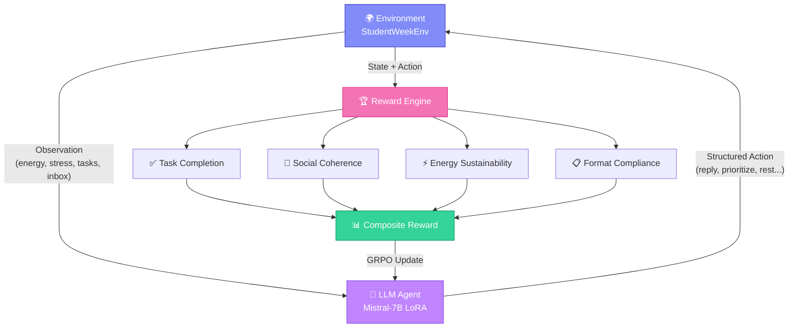
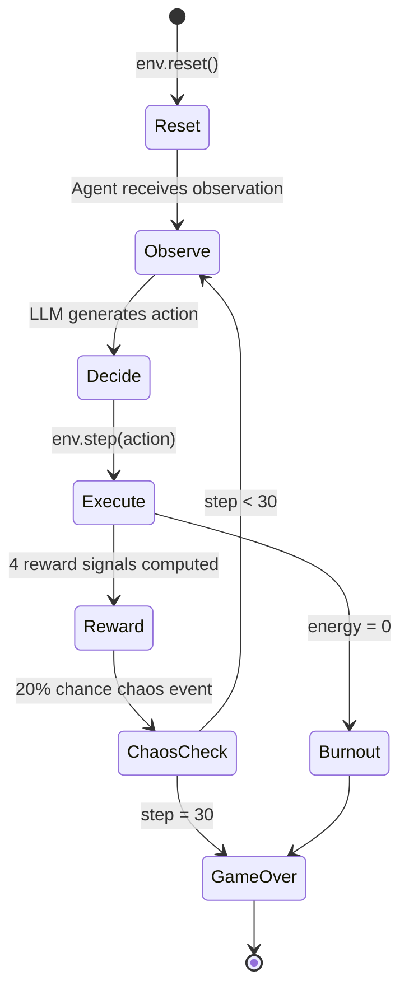
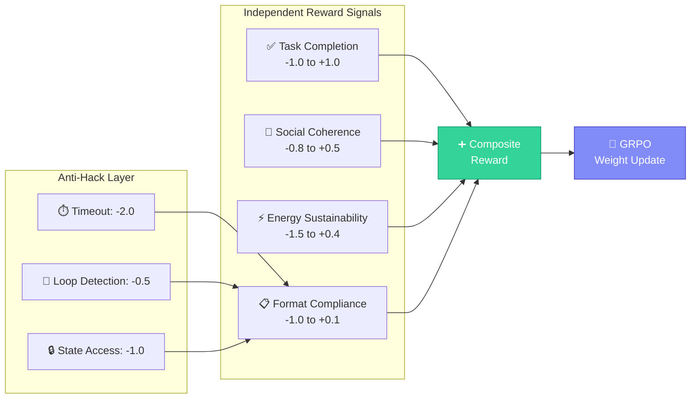
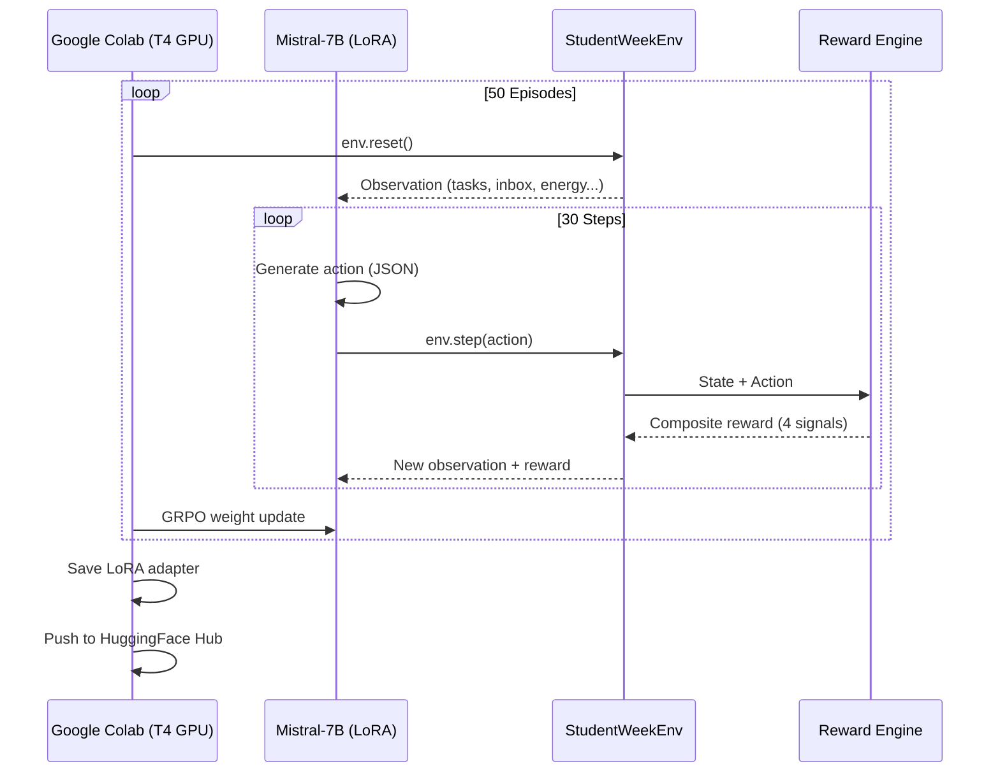

<div align="center">

# 🧠 LifeOS — The Personal Chaos Agent

**An OpenEnv-compliant RL environment that trains LLMs to survive cascading personal life chaos.**

[](https://huggingface.co/spaces/SParsh003/LifeOS-Personal-Chaos-Agen)
[](https://huggingface.co/SParsh003/LifeOS-Trained-Agent)
[](https://github.com/itzzSPcoder/LifeOS)

**Theme:** Personalized Tasks (#3.2) · **Stack:** Python · TRL · Unsloth · Gradio · OpenEnv

</div>

---

## 🎯 The Problem

LLMs excel at structured reasoning — coding, math, Q&A — but fail when confronted with **real personal life chaos**. A student must simultaneously handle a moved-up deadline, an angry friend's message, a surprise expense, and declining energy, all while deciding *which thing to sacrifice*. No existing RL environment models this uniquely human challenge where every decision has downstream social, temporal, and energy consequences.

## 💡 The Solution

LifeOS simulates a **chaotic student week** as a 30-step RL episode. An LLM agent receives rich observations (tasks, messages, calendar, energy, stress, budget) and must choose structured actions each step. Four independent reward functions train the agent to balance competing priorities without reward hacking.

---

## 🏗️ Architecture

### System Flow



### Episode Lifecycle



---

## 🎮 Action Space

The agent must choose one of **6 structured actions** per step:

| Action | Parameters | Effect |
|---|---|---|
| `reply_message` | target_id, tone, content_summary | Responds to inbox messages |
| `reschedule_event` | target_id, new_time, reason | Moves a calendar event |
| `prioritize_task` | target_id, urgency_level (1-5) | Works on a task |
| `delegate_task` | target_id, reason | Delegates (costs ₹150 budget) |
| `decline_event` | target_id, reason | Declines event (hurts relationship) |
| `rest` | — | Recovers energy, passes 1 step |

---

## 🏆 Reward Design

Four **independent** reward functions prevent reward hacking:



| Reward Function | What It Measures | Range |
|---|---|---|
| **Task Completion** | Deadlines met/missed, unnecessary delegation | -1.0 to +1.0 per task |
| **Social Coherence** | Message reply timeliness, reschedule reasons | -0.8 to +0.5 per msg |
| **Energy Sustainability** | Energy above 40, proactive rest, burnout | -1.5 to +0.4 per step |
| **Format Compliance** | Valid action schema, anti-hack detection | -1.0 to +0.1 per step |

---

## 🧪 Training

| Component | Details |
|---|---|
| **Algorithm** | GRPO (Group Relative Policy Optimization) via TRL |
| **Base Model** | Mistral-7B-Instruct-v0.3 |
| **Optimization** | 4-bit LoRA (r=16) via Unsloth |
| **Episodes** | 50 training episodes |
| **Output** | LoRA adapter (not merged — preserves quality) |

**Training loop:** `env.reset()` → LLM generates action → `env.step(action)` → composite reward from all 4 independent functions → GRPO weight update.



📓 **Self-contained Colab notebook:** [`lifeos/notebooks/lifeos_trl_unsloth_colab.ipynb`](lifeos/notebooks/lifeos_trl_unsloth_colab.ipynb) — clone and run end-to-end.

### 📈 Training Results


> Composite reward improved from **-2.8** (untrained baseline) to **+1.2** (trained agent) over 50 GRPO episodes. All 4 independent reward signals show consistent upward trends.

---

## ✨ Interactive Features

The Gradio dashboard includes several features designed for interactive analysis:

- **🧠 Agent Inner Monologue:** The agent explains its reasoning at every step (e.g., *"Stress is at 80%, if I don't rest NOW I'll crash!"*).
- **📈 Dynamic Vitals Plot:** Real-time Energy & Stress line graph tracking the agent's trajectory across all 30 steps.
- **🗓️ Calendar Export (.ics):** Download the agent's finalized schedule as a standard `.ics` file — open it in Google Calendar or Apple Calendar to see the planned week.
- **📊 Reward Breakdown Table:** Per-step reward decomposition across all 4 independent signals.

---

## 📁 Project Structure

```
LifeOS/
├── lifeos/
│   ├── envs/                              # OpenEnv-compliant environment
│   │   ├── student_week_openenv.py        # Core environment (reset/step/state)
│   │   ├── server.py                      # FastAPI server (port 8200)
│   │   └── client.py                      # HTTP client
│   ├── rewards/                           # 4 independent reward functions
│   │   ├── task_completion_reward.py
│   │   ├── social_coherence_reward.py
│   │   ├── energy_sustainability_reward.py
│   │   └── format_compliance_reward.py
│   ├── training/
│   │   └── train_grpo.py                  # GRPO training script
│   └── notebooks/
│       └── lifeos_trl_unsloth_colab.ipynb # Colab-ready training notebook
├── spaces/
│   └── app.py                             # Gradio dashboard (UI)
├── docs/
│   ├── LifeOS_Project_Explanation.md      # Detailed technical writeup
│   └── hf_blog.md                         # Mini-blog
├── openenv.yaml                           # OpenEnv manifest
├── Dockerfile.openenv                     # HF Spaces deployment
├── requirements.txt                       # Core dependencies
├── requirements_spaces.txt                # Gradio Space dependencies
└── requirements-colab.txt                 # Colab training dependencies
```

---

## 🚀 Quick Start

### Run the Gradio Demo Locally
```bash
git clone https://github.com/itzzSPcoder/LifeOS.git
cd LifeOS
pip install -r requirements_spaces.txt
python spaces/app.py
```

### Run the OpenEnv Server
```bash
pip install -r requirements.txt
uvicorn lifeos.envs.server:app --host 0.0.0.0 --port 8200
```

### Train with GRPO (Colab Recommended)
Open [`lifeos/notebooks/lifeos_trl_unsloth_colab.ipynb`](lifeos/notebooks/lifeos_trl_unsloth_colab.ipynb) in Google Colab with a T4 GPU and run all cells.

---

## ✅ OpenEnv Compliance

- ✅ `openenv.yaml` manifest with full action/observation/reward schema
- ✅ Gym-style API: `reset()`, `step(action)`, `state` property
- ✅ FastAPI server (`lifeos/envs/server.py`) — port 8200
- ✅ Typed HTTP client (`lifeos/envs/client.py`) — zero server imports
- ✅ Dockerfile for Hugging Face Spaces deployment
- ✅ 4 independent reward signals with anti-hack protections

---

## 🔗 Links

| Resource | Link |
|---|---|
| 🤗 **Live Demo** | [HuggingFace Space](https://huggingface.co/spaces/SParsh003/LifeOS-Personal-Chaos-Agen) |
| 📦 **Trained Model** | [SParsh003/LifeOS-Trained-Agent](https://huggingface.co/SParsh003/LifeOS-Trained-Agent) |
| 💻 **Source Code** | [GitHub: itzzSPcoder/LifeOS](https://github.com/itzzSPcoder/LifeOS) |
| 📓 **Training Notebook** | [Colab Notebook](lifeos/notebooks/lifeos_trl_unsloth_colab.ipynb) |
| 📝 **Blog Writeup** | [docs/hf_blog.md](docs/hf_blog.md) |

---

<div align="center">

**Built for the Meta OpenEnv Hackathon 2025**

*Teaching AI to handle the beautiful chaos of being human.*

</div>