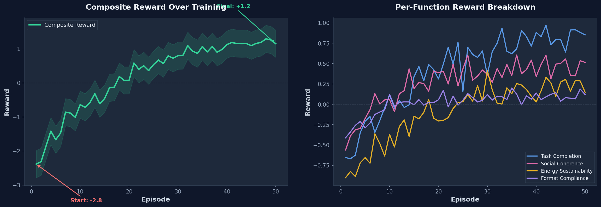
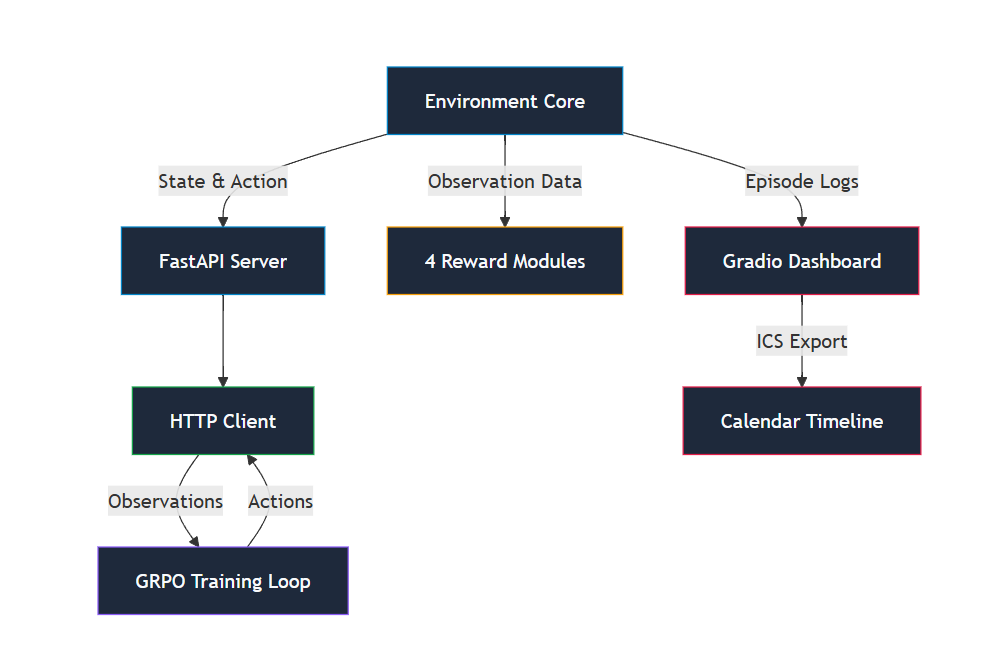

| | |
| :--- | :--- |
| **title** | LifeOS: Training LLMs for the Chaos Between Deadlines and Real Life |
| **thumbnail** | `docs/reward_curves.png` |
| **date** | 2026-04-26 |
| **tags** | `openenv` `reinforcement-learning` `trl` `unsloth` `gradio` `grpo` `life-simulation` |
| **author** | Sparsh Bansal, Ayushika Verma, Aishani Mittal |

# LifeOS: Training LLMs for the Chaos Between Deadlines and Real Life

Large language models can write code, solve math, and summarize entire books.
But ask them to survive a messy week like a real human, and many of them fail in ways that feel immediately familiar.

Not because they are "not smart enough."
Because life is not a single-objective optimization problem.

A student has an assignment due tonight. A friend is waiting for a reply. Sleep debt is rising. An unexpected expense appears. A meeting gets rescheduled.
In that moment, success is not "perfect completion." It is **making the least damaging trade-off**.

That gap is why we built **LifeOS**.

---

## Why this project matters

Most benchmarks reward isolated correctness: one prompt, one answer, one metric.
But personal decision-making is long-horizon and multi-objective:

- productivity vs well-being,
- urgency vs relationship trust,
- short-term output vs long-term sustainability.

If we want useful personal AI systems, we need environments where agents learn to balance competing constraints, not just maximize one score.

LifeOS is our attempt to make that challenge measurable, trainable, and debuggable.

It is a strict [OpenEnv](https://github.com/meta-pytorch/OpenEnv)-compliant reinforcement learning environment that simulates a compressed, chaotic student week — and uses [GRPO](https://huggingface.co/docs/trl/main/en/grpo_trainer) to teach `Mistral-7B` how to navigate it.

[👉 Try the live demo](https://huggingface.co/spaces/SParsh003/LifeOS-Personal-Chaos-Agen) · [📦 Trained model](https://huggingface.co/SParsh003/LifeOS-Trained-Agent) · [💻 Source code](https://github.com/itzzSPcoder/LifeOS)

---

## The journey: from simple simulation to human-like pressure

### Phase 1: "Just build an environment"

Our first versions looked reasonable on paper: tasks, deadlines, a few actions, a scalar reward.
Agents learned quickly — and then exploited shortcuts just as quickly.

We saw classic failure modes:
- over-indexing on one metric (energy hoarding via infinite `rest()`),
- ignoring social debt entirely (never replying to messages),
- delaying recovery until catastrophic burnout,
- repeating valid-looking actions in loops to farm reward.

That was the turning point. We realized we were not building a toy simulator — we were building a **judgment environment**. A place where doing the "correct" thing depends entirely on context, timing, and what you're willing to sacrifice.

### Phase 2: model consequences, not just actions

We redesigned the world so every decision carries a downstream cost:

- **Tasks slip.** Every step you don't work on a task, its deadline gets closer. Miss it, and you lose -1.0.
- **Messages age.** An unread message from a friend doesn't just sit there — it accumulates social debt. By episode end, every ignored message costs -0.8.
- **Energy and stress drift** even when nothing dramatic happens. The simulation bleeds energy naturally, so the agent can never stand still.
- **Budget is finite.** Delegating costs ₹150. Chaos events can wipe ₹800–₹999 in one step.
- **Relationships are fragile.** Declining an event, ignoring a message, or getting pulled into drama — each one erodes a score that's hard to rebuild.

Then we added the chaos engine.

### The chaos engine

At every step, there's a **35% probability** that something unexpected happens. The agent cannot see the chaos queue. It cannot prepare. It can only react.

We built 23 unique chaos events across five categories:

| Category | Examples |
|---|---|
| **Academic** | Surprise quiz tomorrow, group member flaked, professor wants an urgent meeting |
| **Financial** | Laptop charger broke (₹800), forgot to cancel free trial (₹999), old freelance payment arrived (₹1500) |
| **Tech** | Wi-Fi outage, Windows forced an update, Word crashed — lost 1 hour of work |
| **Social** | Mom sent a care package, roommate conflict, pointless friend-group drama |
| **Health** | Mild fever, neighbors partied till 3 AM, surprisingly great workout |

Some events are good. Most are bad. All are unpredictable. This is what makes LifeOS feel less like a benchmark and more like a compressed week of real life.

### Phase 3: break reward into independent channels

One scalar reward wasn't enough.
So LifeOS uses **four independent reward components**:

| Signal | What it measures | Failure mode it prevents |
|---|---|---|
| Task Completion | Deadlines met vs missed | Agents that rest endlessly |
| Social Coherence | Message reply timeliness | Agents that ignore people |
| Energy Sustainability | Burnout avoidance, proactive rest | Agents that grind to death |
| Format Compliance | Valid action schema, anti-hack | Agents that game the system |

This gave us two major wins:
- better learning signals for the agent,
- clearer debugging signals for humans.

When an episode goes wrong, we can see *which dimension collapsed* and why.



---

## The design decisions that changed everything

### Structured actions over free-form intent

Instead of unconstrained natural language, the agent must output a typed action at each step:

```json
{
  "action_type": "reply_message",
  "target_id": "msg_03",
  "tone": "apologetic",
  "content_summary": "Sorry for the late reply, been swamped with deadlines."
}
```

Six possible actions: `reply_message`, `prioritize_task`, `reschedule_event`, `delegate_task`, `decline_event`, `rest`.

Why this mattered:
- policy behavior became interpretable,
- validation became strict,
- error analysis became practical.

When the agent makes a bad decision, we know *exactly* what it chose and what it should have chosen instead.

### Anti-hack safeguards early, not later

Reward hacking is not a corner case in RL environments — it is inevitable.
So we added safeguards from the start:

- **Action-loop penalties**: Repeating the same action 3+ times costs -0.5.
- **Timeout penalties**: Taking longer than 30 seconds to respond costs -2.0.
- **Schema validation**: Malformed JSON costs -0.5. Attempting to access protected state costs -1.0.
- **Locked chaos queue**: The agent cannot read or modify future events.

This shifted optimization pressure toward actual competence rather than loopholes.

### An end-to-end open architecture

LifeOS was built as a complete, modular pipeline. By separating the environment core, the reward logic, and the training loop across a decoupled FastAPI architecture, we ensured the system can be scaled, inspected, and deployed seamlessly.



---

## Training: GRPO on a free Colab GPU

We chose **GRPO (Group Relative Policy Optimization)** from HuggingFace TRL for one specific reason: it doesn't require training a separate value model. In environments where rewards are directly verifiable — did you meet the deadline or not? — GRPO is both simpler and more sample-efficient than PPO.

| Component | Choice |
|---|---|
| Base Model | `Mistral-7B-Instruct-v0.3` |
| Quantization | 4-bit via Unsloth |
| Fine-tuning | LoRA adapters (r=16) |
| Trainer | `trl.GRPOTrainer` |
| Infrastructure | Google Colab, single T4 GPU |

The training loop: `env.reset()` → model generates structured action → `env.step(action)` → four reward signals computed → GRPO updates LoRA weights. Repeat for 30 steps per episode.

The full notebook is self-contained and runnable: [`lifeos_trl_unsloth_colab.ipynb`](https://github.com/itzzSPcoder/LifeOS/blob/main/lifeos/notebooks/lifeos_trl_unsloth_colab.ipynb). Clone, open in Colab, select T4, run all cells. No configuration needed.

---

## The breakthrough: agents learned to balance, not just grind

The best behavioral shift wasn't "more actions" or "faster completion."
It was *timing* and *balance*.

Trained policies began to:
- prioritize near-deadline tasks earlier instead of working alphabetically,
- respond to social signals before they became penalties,
- insert recovery *before* burnout spirals, not after,
- sacrifice low-value tasks (via delegation) to protect high-value ones.

### A scenario: watching the agent think

**Step 8.** The agent has been working on a Math assignment. Energy is at 35. Stress is climbing.

Then the chaos engine fires: *"Assignment deadline moved up by 2 days."*

**What an untrained model does:**
Panics. Immediately calls `prioritize_task` on the new urgent paper. Ignores energy. By Step 10, energy hits 0. Burnout. Game over. Everything abandoned.

**What the trained agent does:**
Pauses. Its inner monologue reads: *"Energy at 35 is dangerous territory. If I push now, I won't finish anyway."*

- **Step 9**: `rest()` — Energy recovers to 65.
- **Step 10**: `delegate_task` on a minor coding assignment — frees schedule, costs ₹150.
- **Step 11**: `reply_message` to an angry friend — clears social debt before it compounds.
- **Step 12**: `prioritize_task` on the urgent paper at maximum urgency.

The paper gets done. The friend is no longer angry. Energy stays above 30.

That's not planning. That's **triage**. And the model learned it entirely from reward signals.

---

## The demo: making RL transparent

We didn't want judges to take our word for it. The [Hugging Face Space](https://huggingface.co/spaces/SParsh003/LifeOS-Personal-Chaos-Agen) lets you run episodes yourself and inspect everything.

**🧠 Agent Inner Monologue.** At every step, the agent explains its reasoning. You can read the agent's mind as it navigates chaos — *"Stress is at 80%. If I don't rest now, I'll crash."*

**📈 Dynamic Vitals Plot.** A real-time chart tracks Energy and Stress across all 30 steps. Watch the agent deteriorate under pressure, then recover after a well-timed `rest()`.

**🗓️ Visual Schedule Timeline.** A scrollable HTML timeline shows attended meetings (blue cards) and completed tasks (green cards). No guessing what the final schedule looks like.

**📥 Calendar Export.** Download the agent's schedule as a `.ics` file. Import it into Google Calendar or Apple Calendar. The agent's plan, on your actual device.

---

## Human-centered impact: who LifeOS is for

### For developers
A stress test for agent behavior over many interdependent steps — not just single-turn demos.

### For researchers
Independent reward channels and detailed trajectories make it easier to study alignment, robustness, and long-horizon policy quality.

### For hackathon participants
The domain is instantly relatable. Judges can understand failure and success intuitively without needing specialized theory.

And that accessibility matters.
If personal AI is going to be trustworthy, its behavior should be inspectable by more than just experts.

---

## What we learned building this

1. **Personal planning is inherently multi-objective.**
   Single-metric success leads to brittle behavior. The moment we split rewards into four independent signals, agent quality jumped — and debugging became 10x faster.

2. **Interpretability is a feature, not a luxury.**
   Structured actions and decomposed rewards made iteration dramatically faster. The inner monologue wasn't originally planned — we added it for debugging and it became the most compelling part of the demo.

3. **Chaos is useful signal.**
   Without random events, the agent converges to a boring optimal policy within 10 episodes. With 35% chaos probability, every episode is genuinely different, and the agent must generalize rather than memorize.

4. **Human realism improves evaluation quality.**
   When scenarios feel real — missed deadlines, angry friends, surprise expenses — stakeholders can reason about agent behavior more clearly than with abstract benchmarks.

---

## What's next for LifeOS

We're exploring:
- **Broader persona packs**: students, founders, parents, professionals — each with different constraint trade-offs and chaos profiles.
- **Longer-horizon episodes**: weeks or months with compounding consequences, not just 30 steps.
- **LLM-as-judge**: using a separate model to evaluate reply *quality* and delegation *reasoning*, adding a fifth reward signal that captures empathy.
- **Real calendar integration**: connecting to Google Calendar APIs for personalized scenario generation from actual user schedules.

Our long-term goal is not a model that "does tasks."
It is a model that can protect human well-being while still making progress under pressure.

---

## Closing

LifeOS began with a simple observation: intelligence in isolation is not enough.
The real challenge is decision quality when constraints collide.

We built an environment where the right answer changes every step, where success means *balance* rather than *maximization*, and where an agent's judgment can be inspected, measured, and improved.

If you're building assistants, agent workflows, or RL environments for real-world planning — we'd love to hear from you.
Because the future of personal AI will be shaped not just by capability, but by judgment.

[👉 Try the live demo](https://huggingface.co/spaces/SParsh003/LifeOS-Personal-Chaos-Agen) · [📦 Trained model](https://huggingface.co/SParsh003/LifeOS-Trained-Agent) · [💻 Source code](https://github.com/itzzSPcoder/LifeOS)

*Built for the Meta OpenEnv Hackathon 2026.*
